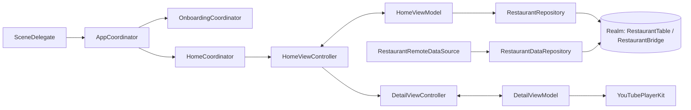
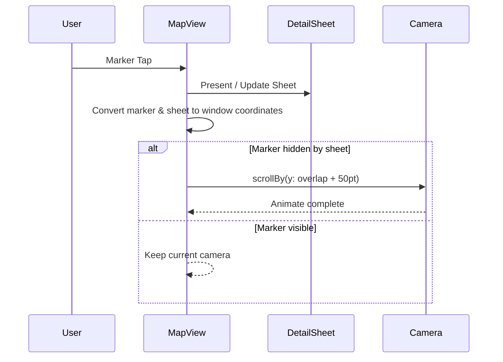

> ⚠️ 현재 성지슐랭 v2를 개발 중입니다. [SeongjiChelin v2 Repository](https://github.com/ParkSY0919/SeongjiChelin)

# SeongjiChelin (iOS 15.0+)
> 손안에서 테마별 맛집을 탐색하고, 방문 기록과 리뷰를 함께 관리할 수 있는 iOS 맛집 큐레이션 앱입니다.

<div align="center">
  
</div>


---

## 주요 화면

|                                                   온보딩                                                   |                                                   사용법                                                   |                                                   홈(맵)                                                   |                                                 홈(리스트)                                                 |
| :--------------------------------------------------------------------------------------------------------: | :--------------------------------------------------------------------------------------------------------: | :--------------------------------------------------------------------------------------------------------: | :--------------------------------------------------------------------------------------------------------: |
|  |  |  |  |

|                                               정보 수정 신고                                               |                                           상세보기(개발자 맛집)                                            |                                         상세보기(인플루언서 맛집)                                          |                                                나만의 식당                                                 |
| :--------------------------------------------------------------------------------------------------------: | :--------------------------------------------------------------------------------------------------------: | :--------------------------------------------------------------------------------------------------------: | :--------------------------------------------------------------------------------------------------------: |
|  |  |  |  |

<br>


## 프로젝트 정보
| 항목 | 내용 |
|---|---|
| 기간 | 집중 개발: 2025.03 ~ 2025.04, 유지보수: 2025.04 ~ 현재 |
| 인원 | 1인 개발 (기획, 디자인, iOS 개발) |
| 버전 | App Version 1.3.0, Deployment Target iOS 15.0 |
| 기술 스택 | Swift 5, UIKit, MVVM, Coordinator Pattern, RxSwift/RxCocoa, Realm, Alamofire, GoogleMaps/GooglePlaces, SnapKit, Then, YouTubePlayerKit, Firebase Storage |

## 주요 기능
| 기능 | 설명 |
|---|---|
| 테마 기반 맛집 탐색 | 6개 테마(주인장 Pick, 성시경, 또간집 등) 기준으로 30개 맛집을 빠르게 탐색할 수 있습니다. |
| 지도/리스트 이중 탐색 모드 | 지도(Map)와 리스트(List)를 전환하면서 같은 필터 컨텍스트를 유지해 연속 탐색이 가능합니다. |
| 상세 정보 + 영상 연동 | 영업시간, 편의정보, 메뉴와 함께 YouTubePlayerKit 기반 리뷰 영상을 상세 화면에서 확인할 수 있습니다. |
| 나만의 맛집 관리 | 방문, 즐겨찾기, 평점/리뷰를 저장하고 조건별로 모아보는 개인화 관리 기능을 제공합니다. |
| 통합 검색 | 이름, 카테고리, 주소를 대상으로 실시간 검색하며 디바운스(debounce) 기반으로 입력 품질을 안정화했습니다. |
| 일일 데이터 패치 | GitHub Releases 기반 원격 데이터 패치를 1일 1회 수행하고, 실패 시 오프라인 폴백(fallback)으로 앱 진입을 보장합니다. |

## 아키텍처


## 기술적 도전과 해결
### 1. 정적 데이터와 사용자 상태를 분리해 조회 경로를 단순화했습니다 — 5개 필터 조건
맛집 마스터 데이터와 사용자 활동 데이터를 같은 레벨에서 다루면 테마, 카테고리, 방문 여부, 즐겨찾기, 평점 여부 조합이 늘어날수록 조회 로직이 UI 계층으로 새어 나가 유지보수가 어려워졌습니다. 그래서 데이터 구조를 재정의하면서 조회 책임을 저장소 계층으로 모아야 했습니다.

**해결 방향:**
- `RestaurantBridge`를 도입해 정적 식당 정보 키(`storeID`)를 중심으로 마스터 데이터를 정규화했습니다.
- `RestaurantTable`과 `RestaurantBridge`를 `LinkingObjects`로 연결해 사용자 상태를 역참조(Reverse Lookup)할 수 있게 했습니다.
- `themePrefix`, `category`, `isVisited`, `isFavorite`, `hasRating`에 인덱스(Index)를 적용하고 `fetchBridgesByComplexFilter`로 복합 조건 조회를 일원화했습니다.

| 구분 | 기존 | 개선 |
|---|---|---|
| 데이터 결합 방식 | 화면 단에서 `storeID` 수동 매칭 | Repository 단에서 Bridge 기반 조합 |
| 조건 확장성 | 조건 추가 시 분기 증가 | 조건 추가 시 쿼리 파라미터 확장 |
| 조회 책임 | ViewModel/VC 분산 | Repository 집중 |

> 결과 수치: 테마/카테고리/방문/즐겨찾기/평점 조건을 저장소 계층의 단일 조회 함수로 처리하도록 정리했습니다.

### 2. 바텀 시트와 지도 마커 충돌을 카메라 보정으로 해결했습니다 — 최소 50pt 가시 여백
상세 바텀 시트(bottom sheet)를 띄운 상태에서 마커를 탭하면 마커가 시트 아래로 가려져 위치 맥락이 끊기는 문제가 발생했기 때문에, 화면 좌표계를 통일해 마커 가시 영역을 유지해야 했습니다.

**해결 방향:**
- 시트 프레임과 마커 포인트를 모두 윈도우 좌표계(window coordinates)로 변환해 비교했습니다.
- `desiredMarkerVisiblePadding`을 50pt로 두고 가려지는 경우에만 `GMSCameraUpdate.scrollBy`를 적용했습니다.
- 동일 계산 로직을 `adjustCameraForMarker`로 분리해 신규 시트 표시와 기존 시트 업데이트 경로에서 재사용했습니다.



> 결과 수치: 마커 선택 시 시트와 겹치는 상황에서도 최소 50pt 상단 여백을 확보해 위치 인지가 끊기지 않도록 개선했습니다.

### 3. 검색 입력의 연산 폭주를 제어해 탐색 흐름을 안정화했습니다 — 300ms 디바운스
검색창 입력마다 즉시 필터링을 수행하면 빠른 타이핑 구간에서 동일 의미의 연산이 반복되어 리스트 갱신이 과도해지고 스크롤 위치가 불안정해질 수 있어서, 사용자 체감 반응성과 연산 비용 사이 균형이 필요했습니다.

**해결 방향:**
- `searchTextFieldText`에 `debounce(.milliseconds(300))`와 `distinctUntilChanged()`를 적용해 불필요한 재연산을 줄였습니다.
- 이름, 카테고리, 주소를 동시에 검사하는 다중 필드 검색으로 입력 의도를 한 번에 반영했습니다.
- 필터 완료 시 `scrollTopTrigger`를 발행해 결과 리스트 탐색 시작점을 일관되게 맞췄습니다.

> 결과 수치: 300ms 기준으로 입력 이벤트를 정규화하면서도 다중 필드 검색 즉시성을 유지해 탐색 안정성을 확보했습니다.


## 프로젝트 구조
```text
SeongjiChelin-iOS/
├─ SeongjiChelin-iOS/ (App, Data, Presentation, Resource, Utility)
├─ scripts/ (맛집 데이터 검증 및 리포트 생성)
└─ .github/ (CI workflow)
```

